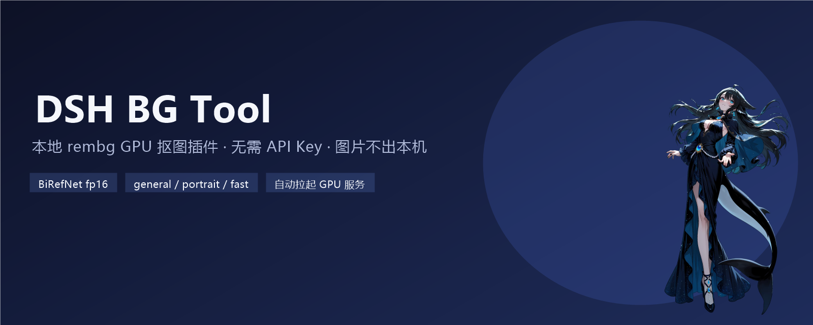
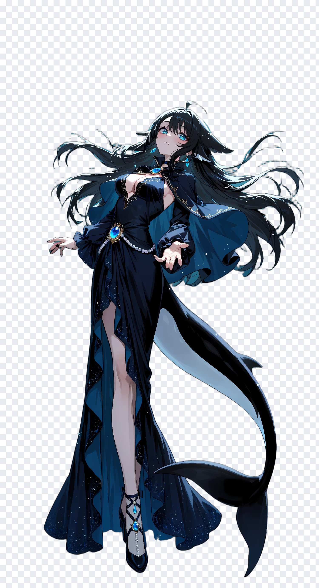
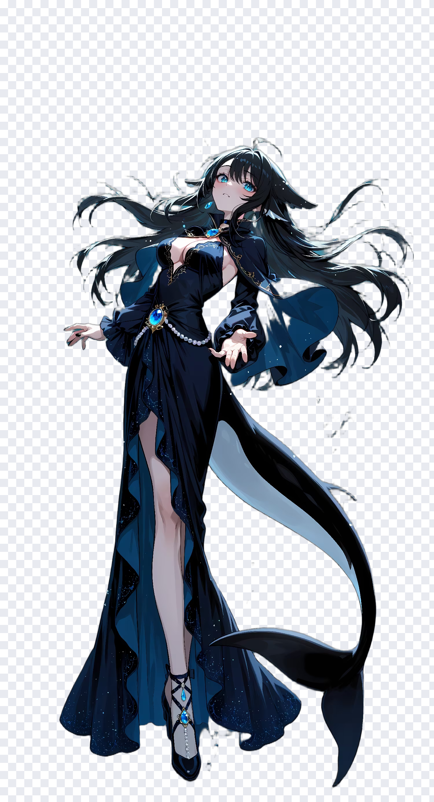
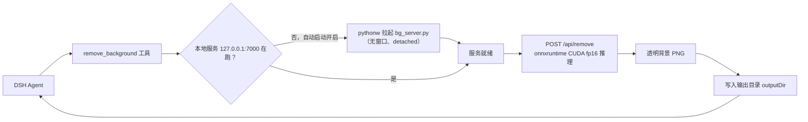
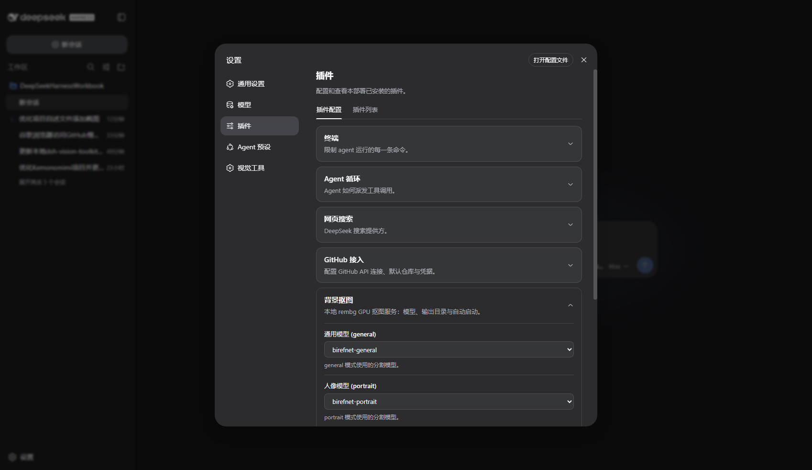

<p align="center">
  
</p>

<div align="center">

# DSH BG Tool

[](https://github.com/H-table/dsh-bg-tool)
[](LICENSE)
[](cordis.patch.yml)
[](#环境要求)

**本地 rembg GPU 抠图插件——给 DeepSeek Harness 一个一键去背景工具：图片不出本机、无需 API Key、三档模型按需切换。**

🚀 对话里直接让 Agent 抠图 | 全本地推理 | 热调用约 1 秒/张 | 服务器自动拉起

</div>

DeepSeek Harness（DSH）里的模型大多只认文字，图片处理往往要「把文件拖出去、开个工具、再把结果拖回来」。DSH BG Tool 把这个流程收进对话本身：你贴一张图、说一句「去掉背景」，Agent 直接调用 `remove_background`，本地 GPU 推理完成后把透明 PNG 写到工作区，全程不离开 Harness。

与云端抠图服务不同，这个插件把 **rembg + BiRefNet** 跑在本机：

- 图片**永远不会上传**到任何第三方服务，敏感素材也放心处理；
- 不需要 API Key、不消耗任何付费额度，**离线可用**；
- 显存、模型、输出目录都在你手里，随时可以换成别的模型。

## Highlights

- **对话内直接抠图。** 把图片放进会话工作区，让 Agent 调用 `remove_background`，透明背景 PNG 直接写入输出目录并返回路径，Web 里可以继续预览、复用。
- **三档模型按需切换。** `general`（BiRefNet-general fp16，任意物体/商品/照片）、`portrait`（BiRefNet-portrait fp16，人物/头发/证件照）、`fast`（u2netp 快速草稿），每个模式都可以在配置卡里单独换模型。
- **全本地 GPU 推理。** BiRefNet 以 fp16 运行并做了 CUDA 调优，热调用约 0.7~1 秒/张（RTX 3070），无需任何网络请求。
- **服务器生命周期自管理。** DSH 启动时自动拉起本地 rembg 服务（`pythonw` 无窗口、后台常驻），插件停止时自动回收；首次调用某模型约 7 秒（加载进显存）。
- **官方同款插件配置卡片。** 设置 → 插件 → 插件配置 →「背景抠图」，模型映射、输出目录、自动启动开关，暂存编辑、已覆盖标记、恢复默认，与官方卡片一致的 UI 和保存语义。

## 效果预览

同一张原图，分别用 `general` 和 `portrait` 模式抠图（透明背景用棋盘格示意）：

<p align="center">
  
  
  
</p>

*左：原图。中：`general` 模式（BiRefNet-general fp16）。右：`portrait` 模式（BiRefNet-portrait fp16）。长发、飘带、半透明裙摆等细节边缘都保持完整。*

## 快速开始：三步

### 1. 准备本地环境（一次性）

插件依赖一个 `.bg-tools/` 环境根目录（Python venv + 模型文件 + `bg_server.py`），解析顺序如下：

1. `$DSH_BG_TOOL_ROOT` 环境变量（显式指定，优先级最高）；
2. `$DSH_HOME/.bg-tools`（或 `~/.dsh/.bg-tools`）——机器本地的默认位置；
3. 旧版工作区路径 `E:/ProjectCode/DeepSeekHarnessWorkbook/.bg-tools`（迁移兼容：存在时自动沿用，新机器上不存在则跳过）；
4. 以上都不存在时，默认使用 `$DSH_HOME/.bg-tools`。

准备完成后结构大致如下：

```text
.bg-tools/
├── venv/            # Python 虚拟环境（含 rembg、onnxruntime-gpu、CUDA 13 运行库）
├── models/          # 模型文件（BiRefNet fp16、u2netp 等）
├── bg_server.py     # 本地 rembg HTTP 服务（fp16 + CUDA 调优）
├── start-server.ps1 # 手动启动脚本（可选）
└── output/          # 默认输出目录
```

装好后可以直接跑一遍冒烟测试：

```powershell
.bg-tools\start-server.ps1   # 手动启动，然后访问 http://127.0.0.1:7000/openapi.json
```

> 也可以不手动启动：插件默认开启「自动启动 GPU 服务」，DSH 运行时会自己把服务拉起来。

### 2. 安装插件（本机 profile）

```json
// ~/.dsh/profiles/web/package.json
"dependencies": { "@local/dsh-bg-tool": "link:<本仓库目录>" },
"dsh": { "profile": { "bundles": ["@local/dsh-bg-tool"] } }
```

并建立 `node_modules/@local/dsh-bg-tool` → 本仓库目录 的符号链接，然后重启 Web Profile。

### 3. 对话里直接抠图

把图片放到会话工作区（或让 Agent 从任何允许的目录读取），直接说：

```text
把 workspace 里的 DSH娘.png 去掉背景，用 portrait 模式。
把这个商品图抠出来，输出到 output 目录，命名 product_1.png。
```

Agent 会调用 `remove_background` 工具并返回 `output_path`；打开该路径就是透明背景 PNG。

## 工具

插件为每个会话注册一个模型工具：

| 工具 | 参数 | 结果 |
|---|---|---|
| `remove_background` | `image_path`（必填，绝对路径，用正斜杠）、`mode`（必填：`general` / `portrait` / `fast`）、`output_name`（可选，默认 `<原名>_<mode>.png`） | 透明背景 PNG，返回 `output_path`、实际使用的 `mode` / `model` |

三种模式的默认模型与适用场景：

| mode | 默认模型 | 适用场景 | 特点 |
|---|---|---|---|
| `general` | `birefnet-general`（fp16） | 任意物体、商品图、照片 | 边缘质量最好 |
| `portrait` | `birefnet-portrait`（fp16） | 人物、头发、证件照 | 人像边缘（发丝等）最稳 |
| `fast` | `u2netp` | 快速草稿、批量预览 | 最快，边缘略糙 |

三个模式都可以在配置卡里替换成任意已安装模型（`isnet-general-use`、`u2net_human_seg`、`u2net` 等）。

## 工作原理

<details>
<summary><strong>架构与调用链</strong></summary>



- **服务生命周期**：插件 `apply` 时自动探测 `http://127.0.0.1:7000`，不在线就 `spawn` 拉起并等待就绪；插件 dispose / DSH 退出时回收。配置里关闭「自动启动」后，需手动运行 `.bg-tools\start-server.ps1`。
- **本地服务**：`bg_server.py` 是 rembg 官方 API 的超集——`POST /api/remove`（multipart `file` + `model`），额外做了 fp16 模型替换、CUDA provider 调优（`arena_extend_strategy=kSameAsRequested`、`cudnn_conv_algo_search=HEURISTIC`、6 GB 显存上限）和 LRU 会话缓存（最多 2 个模型共存，8 GB 显存不爆）。
- **路径约定**：`image_path` 使用绝对路径、正斜杠（`E:/ProjectCode/photo.png`）；输出文件名里的 `\` `/` 会被替换成 `_`，防止跨目录写入。

</details>

## 配置

设置 → 插件 → 插件配置 →「背景抠图」卡片（官方卡片同款 UI：暂存编辑、已覆盖标记、恢复默认）：

<p align="center">
  
</p>

| 字段 | 默认值 | 说明 |
|---|---|---|
| 通用模型 `generalModel` | `birefnet-general` | `general` 模式使用的分割模型 |
| 人像模型 `portraitModel` | `birefnet-portrait` | `portrait` 模式使用的分割模型 |
| 快速模型 `fastModel` | `u2netp` | `fast` 模式使用的快速模型 |
| 输出目录 `outputDir` | `.bg-tools/output` | 结果 PNG 的输出目录（自动创建） |
| 自动启动 GPU 服务 `autoStartServer` | `true` | 关闭后需手动运行 `start-server.ps1` |

也可以在 profile 的 cordis patch 里直接写配置：

```yaml
- id: bg-tool
  config:
    generalModel: birefnet-general
    portraitModel: birefnet-portrait
    fastModel: u2netp
    outputDir: E:/ProjectCode/DeepSeekHarnessWorkbook/.bg-tools/output
    autoStartServer: true
```

## 环境要求

- **DeepSeek Harness Web Profile**（插件以 bundle patch 方式挂载，重启生效）。
- **Windows + NVIDIA GPU**：本地服务默认按本机环境（CUDA 13 运行库、`pythonw.exe`）设计；CPU 环境需自行调整 `.bg-tools`。
- **`.bg-tools/` 本地环境**：venv（rembg + onnxruntime-gpu）、模型文件、`bg_server.py`，见上文「快速开始」。
- 输入图片支持 jpg / png / webp，路径需是 Agent 可读的绝对路径。

## 故障排查

| 问题 | 怎么办 |
|---|---|
| 返回「rembg 服务无法启动」 | 检查 `.bg-tools` 的 venv / models 是否完整；手动运行 `start-server.ps1` 看 `server.err.log` |
| 返回「rembg 服务未运行」 | 配置里关闭了自动启动——手动运行 `.bg-tools\start-server.ps1`，或重新打开自动启动 |
| 首次调用某个模型很慢 | 正常：模型首次加载进显存约 7 秒，之后热调用约 1 秒/张 |
| 显存不足 / CUDA 报错 | 确认 venv 里装有 `onnxruntime-gpu` 且 CUDA 13 运行库在 PATH 上（`start-server.ps1` 会自动处理） |
| 输出文件打不开 | 确认 `outputDir` 存在且可写；输出文件名里的 `\` `/` 会被替换为 `_` |
| 想换模型 | 在配置卡的三个下拉里选择已安装模型（`isnet-general-use`、`u2net_human_seg`、`u2net` 等） |

## 项目结构与许可

```text
dsh-bg-tool/
├── lib/index.js          # 宿主：设置命名空间 + 自有设置路由 + 工具注册 + 服务器生命周期
├── lib/client.js         # 客户端：「背景抠图」插件配置卡片（官方 CardForm 语义）
├── cordis.patch.yml      # bundle patch（注入宿主组合）
└── assets/               # README 截图与演示图
```

插件以 [MIT License](LICENSE) 开源；本地 rembg 服务与模型遵循各自上游许可。`.bg-tools/` 运行时环境不属于本仓库。

配套项目：[dsh-github-tool](https://github.com/H-table/dsh-github-tool)（GitHub 接入）· [dsh-vision-toolkit](https://github.com/Anionex/dsh-vision-toolkit)（视觉工具集）
